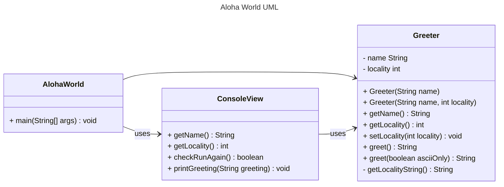

# Homework Aloha World Report

The following report contains questions you need to answer as part of your submission for the homework assignment. 

## Design Doc
Please link your UML design file here. See resources in the assignment on how to
link an image in markdown. You may also use [mermaid] class diagrams if you prefer, if so, include the mermaid code here.  You DO NOT have to include Greeting.java as part of the diagram, just the AlohaWorld application that includes: [AlohaWorld.java], [Greeter.java], and [ConsoleView.java].

### Program Flow
Write a short paragraph detailing the flow of the program in your own words. This is to help you understand / trace the code (and give you practice of something called a code walk that will be required in this course).

The program starts in AlohaWorld.java's main method, which is the entry point. First, the program uses ConsoleView.java to interact with the user; asks for user's name via ConsoleView.getName() and displays the list of localities and asks the user to select a locality by number via ConsoleView.getLocality(). Then, the program creates a new Greeter object with the user's name and chosen locality obtained, and uses ConsoleView.printGreeting(greeter.greet()) to display the greeting, while the greet() method of the object greeter generates a personalized greeting based on the locality selected. Then, the program enters a loop, asking the user if they would like be greeted again via ConsoleView.checkRunAgain(); if yes, the program asks the user to select a locality again and prints a new greeting, if no, the program ends.

## Assignment Questions

1. List three additional java syntax items you didn't know when reading the code.  (make sure to use * for the list items, see example below, the backtick marks are used to write code inline with markdown)
   
   * (example) `final class`
   * `private constructor` `static method` `Scanner class`

2. For each syntax additional item listed above, explain what it does in your own words and then link a resource where you figured out what it does in the references section. 

    * (example) The `final` keyword when used on a class prevents the class from being subclassed. This means that the class cannot be extended by another class. This is useful when you want to prevent a class from being modified or extended[^1] . It is often the standard to do this when a class only contains static methods such as driver or utility classes. Math in Java is an example of a final class[^2] .
    * `Private constructors` allow us to restrict the instantiation of a class. Simply put, they prevent the creation of class instances in any place other than the class itself. There’s no need to allow object instantiation since static methods don’t require an object instance to be used.[^3]
    * The `static keyword` is used to construct methods that will exist regardless of whether or not any instances of the class are generated. Any method that uses the static keyword is referred to as a static method. Features of static method: A static method in Java is a method that is part of a class rather than an instance of that class. Every instance of a class has access to the method. Static methods have access to class variables (static variables) without using the class’s object (instance). Only static data may be accessed by a static method. It is unable to access data that is not static (instance variables). In both static and non-static methods, static methods can be accessed directly.[^4]
    * The `Scanner class` is used to get user input, and it is found in the java.util package. To use the Scanner class, create an object of the class and use any of the available methods found in the Scanner class documentation. For example, nextLine() method reads a String value from the user; nextInt() reads a int value from the user.[^5]

3. What does `main` do in Java?

    The `main` method in Java is the entry point of the program. It's where the execution starts when we run our Java program. Our code will not be executed, if the main method is missing.

4. What does `toString()` do in Java? Why should any object class you create have a `toString()` method?

    In Java, the `toString()` method is used to return a String representation of an object. It allows us to get the string value of an object without casting it to String type. Every class should override it because default implementation only shows memory address. Instead, with the override, we get readable info about object's state. And it also makes debugging easier.

5. What is javadoc style commenting? What is it used for? 

    Javadoc style commenting is a special type of comments used to generate documentation in HTML format for classes, methods, and fields using the Javadoc tool. It typically includes descriptions of the purpose of the code, parameter details, and return values. Using Javadoc style comments make it easier for others to understand and use our code.

6. Describe Test Driving Development (TDD) in your own words. 

    Test Driving Development (TDD) is a programming approach where tests are written before writing the actual code. This makes us focus on the requirements and expected behavior of the code.

7. Go to the [Markdown Playground](MarkdownPlayground.md) and add at least 3 different markdown elements you learned about by reading the markdown resources listed in the document. Additionally you need to add a mermaid class diagram (of your choice does not have to follow the assignment. However, if you did use mermaid for the assignment, you can just copy that there). Add the elements into the markdown file, so that the formatting changes are reserved to that file. 

## Deeper Thinking Questions

These questions require deeper thinking of the topic. We don't expect 100% correct answers, but we encourage you to think deeply and come up with a reasonable answer. 

1. Why would we want to keep interaction with the client contained to ConsoleView?

    I think this is because this keeps the program more organized so that ConsoleView.java can focus on its specific purpose of interacting with the user. And if we want to view or change something regarding user interaction, we can just open and modify ConsoleView.java. Also, separating the user interaction from the rest of the program makes testing easier.

2. Right now, the application isn't very dynamic in that it can be difficult to add new languages and greetings without modifying the code every time. Just thinking programmatically,  how could you make the application more dynamic? You are free to reference Geeting.java and how that could be used in your design.

    Since I learned about Dictionary in Python, I also found that there is a similar thing in Java called Map. The keys and values of Map are the same as Dictionary, so we can use numbers as keys to find values (different localities and greetings). And Map automatically manages memory, so we don't need to fix its size and can add or remove languages and greetings more dynamic.

> [!IMPORTANT]
>  After you upload the files to your github (ideally you have been committing throughout this progress / after you answer every question) - make sure to look at your completed assignment on github/in the browser! You can make sure images are showing up/formatting is correct, etc. The TAs will actually look at your assignment on github, so it is important that it is formatted correctly.

## References

[^1]: Final keyword in Java: 2024. https://www.geeksforgeeks.org/final-keyword-in-java/. Accessed: 2024-03-30. 

[^2]: Math (Java Platform SE 17). https://docs.oracle.com/en/java/javase/17/docs/api/java.base/java/lang/Math.html. Accessed: 2024-03-30.

[^3]: Private Constructors in Java: 2024. https://www.baeldung.com/java-private-constructors. Accessed: 2025-01-26.

[^4]: Static Method in Java With Examples: 2024. https://www.geeksforgeeks.org/static-method-in-java-with-examples/. Accessed: 2025-01-26.

[^5]: Java User Input (Scanner). https://www.w3schools.com/java/java_user_input.asp. Accessed: 2025-01-26.

<!-- This is a comment, below this link the links in the document are placed here to make ti easier to read. This is an optional style for markdown, and often as a student you will include the links inline. for example [mermaid](https://mermaid.js.org/intro/syntax-reference.html) -->
[mermaid]: https://mermaid.js.org/intro/syntax-reference.html
[AlohaWorld.java]: src/main/java/student/AlohaWorld.java
[Greeter.java]: src/main/java/student/Greeter.java
[ConsoleView.java]: src/main/java/student/ConsoleView.java